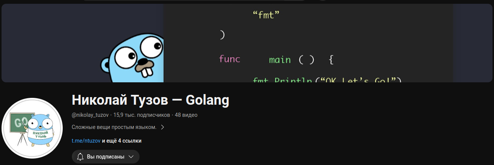
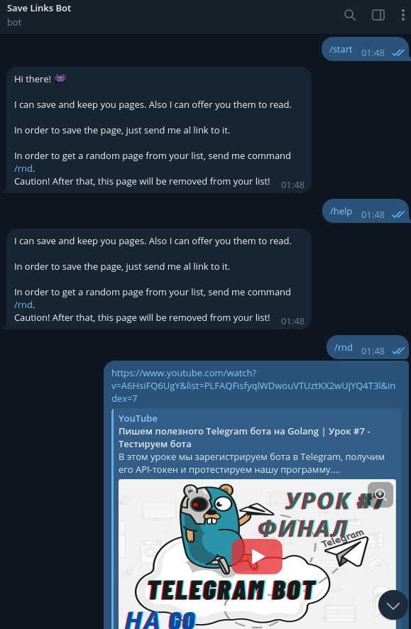
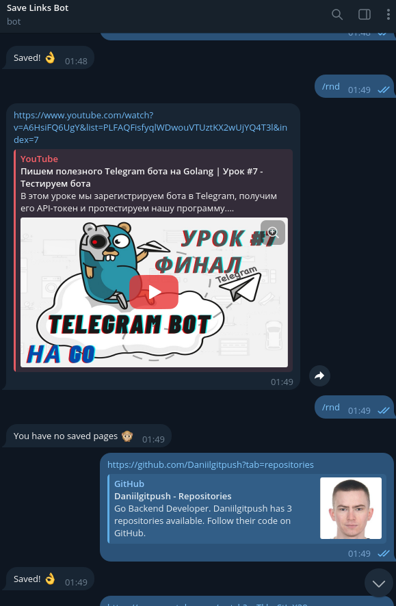
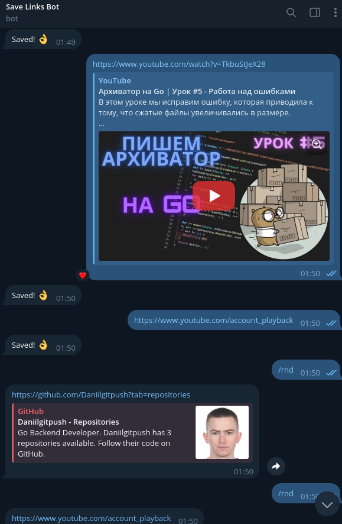
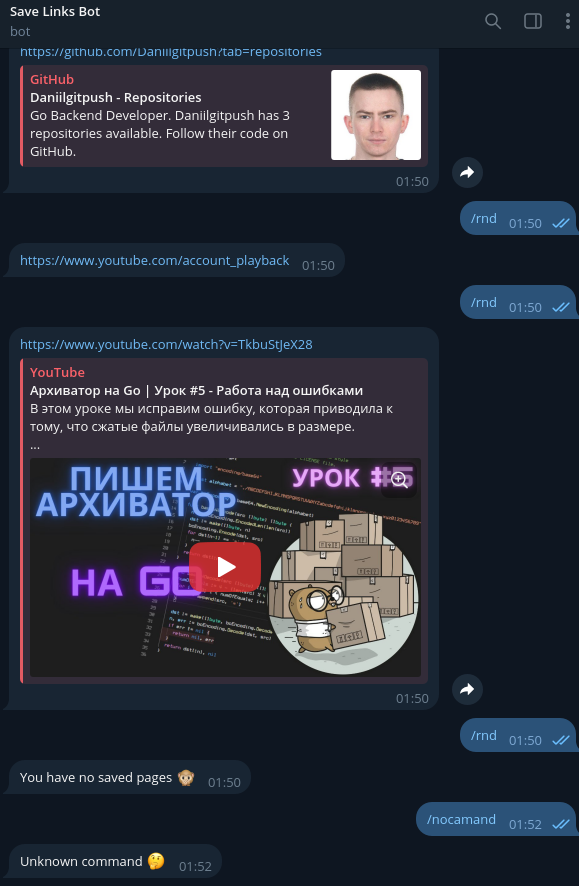
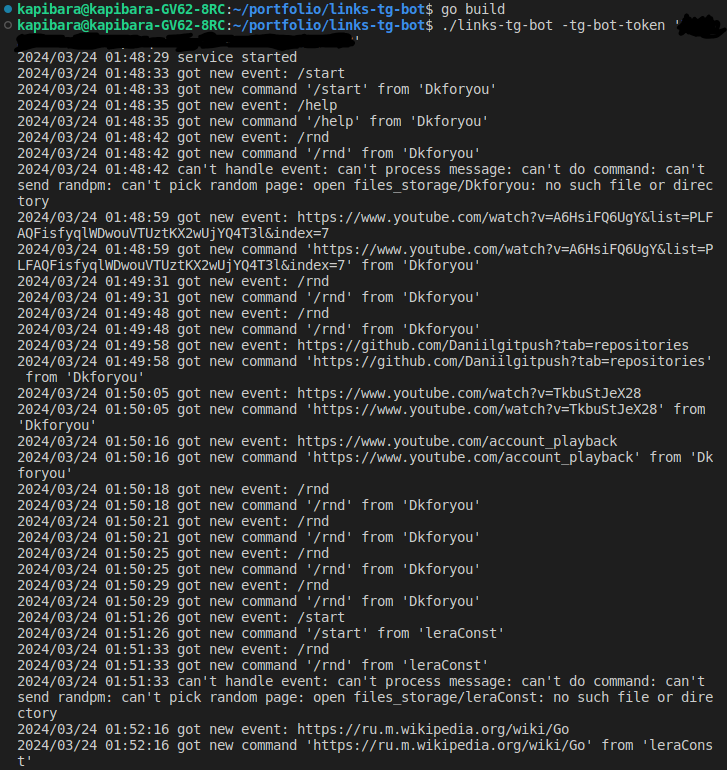

# Read Adviser Bot v1.0

Данный бот умеет сохранять ссылки, которые ему скидывают собеседники, и по запросу отправлять
случайную ссылку из сохраненных.

Это полезно для тех людей, которые часто сохраняют много статей, но забывают их читать :)

Код написан таким образом, чтобы его легко было расширять. К примеру, к нему без труда можно
добавить реализацию для любого другого мессенджера, добавив соотствующий клиент. Остальная логика
останется без изменений.

# Планы

В новой версии подключить PostgreSql для сохранения всех ссылок в БД.

## Хочу выразить благодарность автору канала "Николай Тузов"

 
   

**Ссылка на канал - https://www.youtube.com/@nikolay_tuzov**

***Благодаря урокам автора, я смог создать данного бота!***

**Ссылка на плейлист - https://www.youtube.com/playlist?list=PLFAQFisfyqlWDwouVTUztKX2wUjYQ4T3l**

# Логика бота

***/start - Начало работы бота***

***/help - Информация***

***/rnd - Получение сохраненных ссылок***

*Бот может сохранять неограниченной кол-во ссылок. При команде /rnd бот выдает ссылки по очереди, начиная с первой. После команды /rnd ссылка удаляется из базы.*

# Работа бота

**Базовые команды**
 
   
 
**Выдача ссылки**

   

**Работа с несколькими ссылками**
 
   
 
   

**Логи**
 
   

